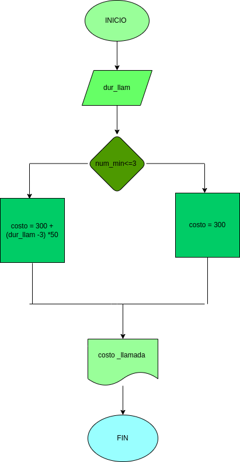

# llamada_telefonica-

ingresar el tiempo de duraccion de una llamada telefonica y determinar la cantidad a pagar de acuerdo con lo siguiente: 
- toda llamada durante 3 inutos o menos tiene un costo de 300 pesos 
- cada minuto adicional cuesta 50 pesos 
# DISEÑO

## DIAGRAMA DE FLUJO 

